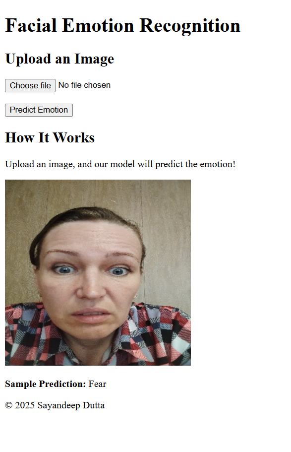

# Facial Emotion Recognition Using CNN

### Sample Screenshot1


### Sample Screenshot2


## Project Overview
This project focuses on building a **Facial Emotion Recognition System** using Convolutional Neural Networks (CNNs). The system is capable of identifying emotions from images, such as **anger**, **contempt**, **disgust**, **fear**, **happy**, **sad**, and **surprised**. The dataset contains images categorized by emotions, along with metadata about the individuals (age, gender, and country).

## Key Features
- **Image-based Emotion Recognition**: The system predicts the emotion of a person based on their facial expression in an image.
- **Custom CNN Model**: Designed and trained a CNN model for multi-class classification.
- **Dataset**: Structured dataset with images and a `.csv` file containing metadata.
- **Evaluation Metrics**: Classification report, confusion matrix, and accuracy for assessing model performance.
- **Flask Web Application**: A simple interface for users to upload an image and view the predicted emotion.

---

## Directory Structure

facial_emotion_recognition/ │ ├── data/ │ ├── images/ │ │ ├── 0/ │ │ │ ├── anger.jpg │ │ │ ├── happy.jpg │ │ │ └── ... │ │ ├── 1/ │ │ │ ├── anger.jpg │ │ │ ├── sad.jpg │ │ │ └── ... │ │ └── ... │ └── emotions.csv │ ├── notebooks/ │ ├── 1_data_analysis_and_preprocessing.ipynb │ ├── 2_model_training.ipynb │ └── 3_model_testing.ipynb │ ├── saved_models/ │ └── emotion_recognition_model.h5 │ ├── app/ │ ├── static/ │ │ └── styles.css │ ├── templates/ │ │ ├── index.html │ │ └── result.html │ ├── app.py │ └── requirements.txt │ └── README.md


---

## Dataset Details

### Structure
- **images/**: Contains folders corresponding to different individuals. Each folder contains images of a person expressing different emotions.
- **emotions.csv**: Metadata for each set of images, including:
  - `set_id`: ID of the image set.
  - `gender`: Gender of the individual.
  - `age`: Age of the individual.
  - `country`: Country of the individual.

### Emotions
- Anger
- Contempt
- Disgust
- Fear
- Happy
- Sad
- Surprised

---

## Project Workflow

### 1. **Data Analysis and Preprocessing**
- Explored the dataset structure using the `1_data_analysis_and_preprocessing.ipynb` notebook.
- Preprocessed images:
  - Resized all images to `48x48`.
  - Normalized pixel values to the range `[0, 1]`.
- Encoded labels using `LabelBinarizer`.

### 2. **Model Training**
- Built a custom CNN model using Keras in the `2_model_training.ipynb` notebook.
- Model architecture:
  - 3 convolutional layers with ReLU activation.
  - Max-pooling layers for dimensionality reduction.
  - Dropout layers to prevent overfitting.
  - Fully connected dense layers for classification.
- Trained the model using a `train-validation-test` split.

### 3. **Model Evaluation**
- Tested the trained model in the `3_model_testing.ipynb` notebook.
- Evaluated performance using:
  - **Classification Report**: Precision, recall, and F1-score for each emotion.
  - **Confusion Matrix**: Visualized using Seaborn heatmap.
  - **Accuracy**: Overall accuracy of the model.

### 4. **Web Application**
- Developed a Flask-based web app to interact with the model.
- Features:
  - Upload an image via the web interface.
  - View the predicted emotion.
  - Simple, user-friendly UI.

---

## Flask Application

### Structure
- **Templates**:
  - `index.html`: Input form for uploading images.
  - `result.html`: Displays the predicted emotion.
- **Static**:
  - `styles.css`: Styling for the web pages.
- **Backend**:
  - `app.py`: Core Flask backend handling image uploads, prediction, and response.

### Running the App
1. Navigate to the `app/` directory.
2. Install dependencies:
   ```bash
   pip install -r requirements.txt
---

### Key Points
- This README file provides a comprehensive overview of the project.
- Includes project structure, dataset details, workflow, results, and future improvements.
- User-friendly instructions for running the Flask app.

Let me know if you need any further updates or explanations!
